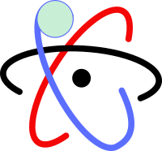
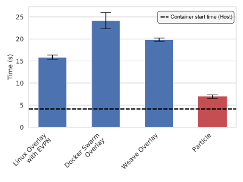
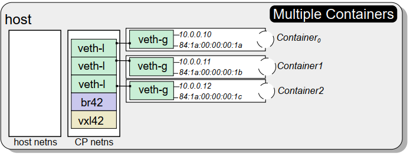
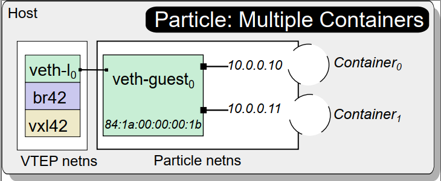

# Particle

Particle is a system that rethinks network startup from the ground up while remaining compatible
with existing containerd and overlay systems such as **Docker Overlay, Kubernetes Pods, Weave Overlay, Linux Overlay**, etc.

Burst parallel serverless jobs finish in seconds, why can't the network do the same?

### The Problem:

Traditional Overlay Network Architecture:

Particle Overlay Network Architecture:

Initial commit for running Particle with a 100 docker containers over N nodes

Configuration from Paper(tested):
Ubuntu 18
Docker 19.03
Kernel 5.0.0

Step1: Generate a list of nodes as IPs in place into the mstr.ips file
Step2: Copy this folder into the home directory of each node
Step3: Run with ./full-controller-particle.sh $NODES $THREADS

Architecture:
TODO

Terraform Script:
TODO

